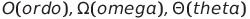
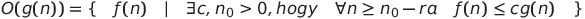
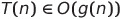
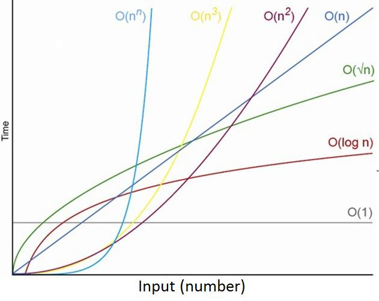

# 2. gyakorlat (Aszimptotikus jelölések)
A mai órán azt fogjuk megnézni, hogy milyen módszerekkel tudjuk megbecsülni azt, hogy egy általunk, vagy valaki más által fejlesztett algoritmus körülbelül mennyi ideig fog futni (és mi történik akkor, ha az algoritmusunk egy több és több, vagy nagyobb és nagyobb adatmennyiséget kap, vagyis hogy mennyire skálázható).
## Alapvető jelölések

- *n*: általában ezzel jelöljük a bemenő adat(ok) méretét, mennyiségét.
- *f(n)*: *n* méretű bemenetre hány lépésben "végez" az algoritmus pontosan. Szoktuk *T(n)*-nel is jelölni.

## Egyszerű példa
Adott egy *n* méretű, egész számokból álló tömb. Az *A* algoritmus bemenetként kapja ezt a tömböt, majd összegzi a benne található értékeket úgy, hogy minden második tömbelemből kivon 1-et, ezt követően az eredményt megszorozza 2-vel. Mi lesz ebben az esetben *T(n)* értéke? Számoljunk:

- *n* db összeadást végzünk, hiszen minden tömbelemet hozzáadunk az eredményhez.
- *n/2* db kivonást végzünk, hiszen minden 2. tömbelemből kivonunk 1-et.
- 1 db szorzást végzünk a legvégén.
- Tehát *T(n) = n + n/2 + 1 = 3n/2 + 1*. 

## Ordó, Theta, Sigma
Nem mindig tudjuk megmondani egyértelműen *n* függvényében, hogy pontosan hány lépésben ér véget egy algoritmus, hiszen ez alapvetően nem csak a bemenet méretétől, hanem összetételétől függ. Tudunk viszont mondani három dolgot:

- Legjobb,
- Legrosszabb,
- Átlagos esetben mennyi idő alatt fut le az algoritmus *n* input méretre?

**Nézzünk gyorsan egy előző órai példát:**

Egy egyetemista a fesztiválon átbulizott éjszaka után elfelejti, hogy a kempingben hol is volt a sátra. A kempingben *n* sátorhely van, amik egy sorban helyezkednek el. Az egyetemista csak akkor ismeri fel a sátrát, mikor másodszor is alaposan megnézi, így a következő stratégiát alkalmazza: először elmegy a kemping másik széléig, miközben minden sátorhelyet megnéz. Majd mivel elsőre nem találja meg a sátrat, visszafordul, és újra megvizsgálja az összes sátorhelyet, amíg rá nem lel a sajátjára. Hányszor kell az egyetemistának vizsgálódnia a legjobb, a legrosszabb és az átlagos esetben?

A feladatot megoldottuk előző órán, így most csak a megoldást írjuk fel gyorsan:

- Legjobb esetben *n+1* vizsgálódás: ez akkor történik meg, ha az *n*. sátor az övé.
- Legrosszabb esetben *2n*: ekkor az 1. sátor az övé.
- Átlagos eset: ezt úgy számoltuk, hogy végigszámoltunk minden esetet, összegeztük a vizsgálódások számát, majd átlagoltunk. Így jött ki a *(3n+1)/2*.

A legtöbb esetben nem igazán érdekel minket, hogy **pontosan** hány lépésből áll megoldani egy problémát, csupán az számít, hogy kb. mekkora nagyságrendű a ráfordított idő *n* függvényében. Erre fogjuk használni az  jelöléseket. Az utóbbi kettő előadáson kerül tárgyalásra, mi egyedül az ordóval fogunk foglalkozni most, hiszen a legtöbbször az érdekel minket, hogy mire számíthatunk egy algoritmus futása során **legrosszabb** esetben. Lássuk hát a formális definiciót, aztán dekódoljuk, hogy ez mit is jelent:

## Ordó


Oké, ez így hirtelen elég ijesztőnek tűnhet, nem is fogunk most azzal időt tölteni, hogy szimbólumról szimbólumra értelmezzük ezt a definiciót, viszont néhány megállapítást gyorsan tehetünk:

- Ezek szerint ha azt mondjuk, hogy *O(g(n))*, akkor ez alatt egy egész "függvénycsaládot" értünk, hiszen ez valamilyen függvényeknek a halmazát jelenti. Vagyis ha pl. azt mondom, hogy *O(n)*, akkor az nem egy konkrét függvényt jelent, hanem sok-sok függvény halmazát.
- Egy tetszőleges *f(n)* függvény akkor része egy *O(g(n))* halmaznak, ha tudunk találni egy olyan *n0* pontot és egy olyan *c* konstanst, hogy onnantól kezdve már minden *n* értékre ezt az *f* függvényt felülről korlátozza a *g*-nek valamilyen *c* konstansszorosa. Ezt most nem fogjuk nagyon kielemezni, de ha kicsit nézegetitek, hamar rájöhettek, hogy ez csak annyit jelent, hogy minden olyan *f(n)* függvény benne lesz egy *O(g(n))* halmazban, ahol egyébként a *g(n)* függvény nagyságrendileg megegyező módon, vagy gyorsabban nő, mint *f(n)*, ha *n* tart a végtelenbe.

Ezek alapján akkor mondhatunk olyat, hogy , ezzel azt mondjuk, hogy *T(n)* is egy olyan függvény, ami nagyságrendileg legfeljebb olyan gyorsan nő, mint *g(n)*. Gyakran használjuk egyébként ehelyett a *T(n) = O(g(n))* jelölést, ez alatt pedig ugyanazt értjük, mint amit az imént felírtam. Ez az ordó jelölés nekünk ezek szerint pont jó lesz arra, hogy megmondjuk azt, hogy nagyságrendileg mennyi ideig fog futni egy algoritmus legrosszabb esetben. *g(n)*-t mindig valamilyen alapfüggvénynek választjuk (pl. *n*, *n^2*, *log(n)*), mert így praktikus.

## Néhány példa

Nézzünk néhány legrosszabb eset futási időt, majd mondjuk meg, hogy ezek milyen nagyságrendű futási idők!

- *T(n) = 3n/2+5 = O(n)*. Gyakorlatilag ezzel azt mondjuk, hogy a 3/2-es szorzó és az 5 hozzáadása semmit nem számít, ha *n* már nagyon nagy, az egyetlen dolog, ami fontos, az az, hogy lineáris függvény a *T(n)*. Természetesen *T(n) = O(n/2), T(n) = O(3n), T(n) = O(9n+34)* is mind teljesülnek (próbálgassuk csak a definició alapján), de ezért mondtuk az elején, hogy *g(n)* legyen valamilyen alapfüggvény, mert ezzel tudjuk a nagyságrendet jól jelölni. Pl. *T(n) = O(1)* már nem igaz.
- *T(n) = 3n^2+5n+9*: Megint csak azt nézzük, hogy ha n elég nagy, akkor mi az, ami igazán domináns lesz ebben a függvényben? Ez egy négyzetes függvény, tehát mind a lineáris, mind a konstans tag, sőt, még a négyzetes tag együtthatója is vajmi keveset számít, ha kellően nagy *n*-t választunk, tehát *T(n) = O(n^2)* (természetesen ezek mind kijönnek a definicióból is, de talán így intuitívebb). Figyeljük meg, hogy *T(n) = O(n)* már nem teljesül ebben az esetben.
- *T(n) = 3log(n+4)+7nlog(n)+2n*: Itt már 3 db *n*-es tagunk is van, csak azt kell eldönteni, hogy melyik a "legdominánsabb" ezek közül, ez pedig nem más, mint a *2n*, hiszen ez növekszik a leggyorsabban, vagyis *T(n) = O(n)*.
- *T(n) = sqrt(56)+76/34+10256 = O(1)*: Ez gyakorlatilag azt jelenti, hogy az algoritmus futási idejét nem befolyásolja az, hogy mekkora az input mérete. **Nem jelenti azt, hogy feltétlenül gyors is!**
- *T(n) = 3log(n+4)+7nlog(n) = O(nlog(n))*, hasonló megfontolásokból.
- *T(n) = 7n^4+5n^3+104n+98 = O(n^4)*.


## Alapfüggvények növekedése szemléletesen



## Feladatok
1. Sátras feladat ordója?
2. Rendezetlen tömbben elem megtalálása?
3. Redezett tömbben elem megtalálása?
4. Két vektor skaláris szorzatának kiszámítása?
5. Két nxn-es mátrix szorzása?

```
# 2. feladat
def find_element(arr, x):
    
    # i indexet 0-tól futtatjuk a tömb hosszáig
    for i in range(len(arr)): 
        # ha megtaláltuk, örülünk
        if arr[i] == x:
            return x
    # ha nem találtuk meg, szomorúak vagyunk.
    return -1
```

**Megoldás:** mivel 1-szer járjuk csak végig az tömböt, és vissza is térünk, ha megtaláltuk *x*-et, legrosszabb esetben *n* lépésből megvagyunk, tehát *T2(n) = O(n)*.

```
# 3. feladat
def find_binSearch(arr, x, l = 0, r = len(arr)-1):
    '''
    Itt arr és x jelentése viszonylag egyértelmű, 
    l: az arr tömbben a keresési tartomány bal szélének indexe,
    r: az arr tömbben a keresési tartomány jobb szélének indexe.
    
    Értelemszerűen l=0, r=len(arr)-1 paraméterekkel indítunk, ezeket beállítjuk default-nak.
    '''

    if r >= l:
        # megkeressük a középső elemet a tömbben
        mid = round(l+(r-l)/2)
        # ha megtaláltuk, örülünk
        if arr[mid] == x:
            return mid
        # ha a középső elemnél nagyobbat keresünk, akkor újraindítjuk a keresést, de most már csak az eddig vizsgált tömb jobb felén.
        if arr[mid] > x:
            return find_binSearch(arr,x,l,mid-1)
        # ha ennél kisebbet keresünk, akkor pedig a bal felén keresünk tovább az eddig vizsgált régiónak.
        return find_binSearch(arr,x,mid+1,r)
    
    return -1
```

**Megoldás:** Legyen *n = 2^k* (tehát *n* 2-nek valamilyen egész kitevőjű hatványa). 

Rekurzív összefüggéssel felírható, hogy

*T(n) = T(n/2)+O(1)*.

**Miért?** Hát mert az *n* méretű (rendezett) tömbben keresés futási ideje úgy jön ki, hogy egyrészt végrehajtom a függvényt az *n* méretű inputra (mivel itt nincs for ciklus, csak 1-1 műveletet csinálunk, ezért ez *O(1)*), másrészt meghívom rekurzívan ugyanezt a függvényt egy feleakkora méretű inputra (lényegében azt a felezést csinálom, amit 1. órán megbeszéltünk), ennek a futási ideje pedig *T(n/2)*. Ezt persze tovább bonthatom, hiszen

*T(n/2) = T(n/4)+O(1), T(n/4) = T(n/8)+O(1), ...*, tehát

*T(n) = T(n/2)+O(1) = T(n/4)+2 * O(1) = T(n/8)+3 * O(1) = ... = T(1) + k * O(1)*,

hiszen *k*-szor kellett feleznem (mert *n* 2-nek *k*-adik hatványa). De mit is jelent *k*? Ez az a szám, amelyre ha a 2-t emelem, *n*-t kapok, vagyis *k = log2(n)*. Folytassuk akkor:

- *T(1) = O(1)*, hiszen egy 1 méretű inputra csak egyszer fogom meghívni a függvényt, nem lesz rekurzió, a függvényen belül pedig nincsenek for ciklusok, vagyis
- *T(n) = T(1) + k * O(1) = O(1) + log2(n) * O(1) = O(log2(n))*, vagyis az algoritmus logaritmikus futási idejű.


```
# 4. feladat
def scalar_prod(v1, v2):
    
    result = 0
    # feltételezzük, hogy azonos hosszúságú vektorokat adtunk meg.
    for i in range(len(v1)):
        result += v1[i]*v2[i]
    return result
```

**Megoldás:** 1-szer végigjárjuk a  tömböt, ezen belül minden indexnél végzünk egy összeadást, és egy szorzást. Tehát *T(n) = n * 2 = O(n)*

```
# az 5. feladathoz már szükségünk lesz egy külső könyvtárra
import numpy as np

# 5. feladat
def matrix_prod(m1,m2):
    
    # feltételezzük, hogy mindkét mátrix nxn-es. Létrehozzuk az eredménymátrixot, feltöltjük nullákkal.
    n = m1.shape[0]
    result = np.zeros((n,n)) 
    
    # i-t végigfuttatjuk az eredménymátrix sorain
    for i in range(n):
        # j-t végigfuttatjuk az eredménymátrix oszlopain
        for j in range(n):
            # k jelöli az 1. mátrix oszlopindexét és a 2. mátrix sorindexét egyszerre.
            for k in range(n):
                result[i,j] += m1[i,k]*m2[k,j]
    
    return result      
```

**Megoldás:** 3 egymásba ágyazott(!) for ciklust futtatunk, a legbelső ciklusmagban pedig 2 műveletet végzünk el (1 összeadás, 1 szorzás), tehát *T(n) = n * n * n * 2 = 2n^3 = O(n^3)*.

**Megj.:** Ha mondjuk olyan algoritmusunk lenne, ami 3 egymás utáni for ciklust futtatna, minden ciklusmagban egyetlen művelettel, akkor az már nem köbös futási idejű lenne, hiszen *T(n)= 3n* műveletet kellene csak végrehajtani, ami miatt a futási idő lineáris lenne.
